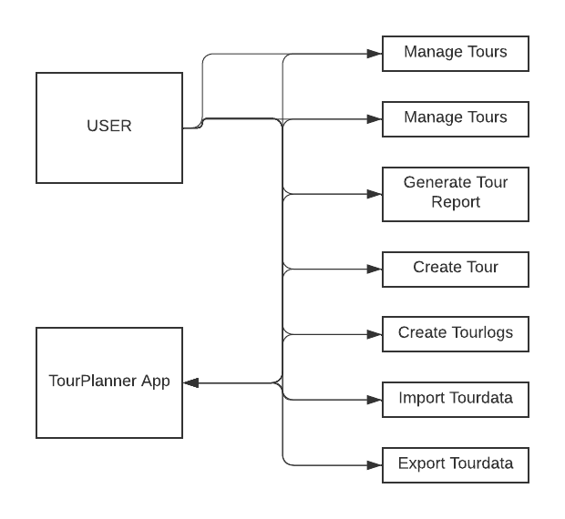
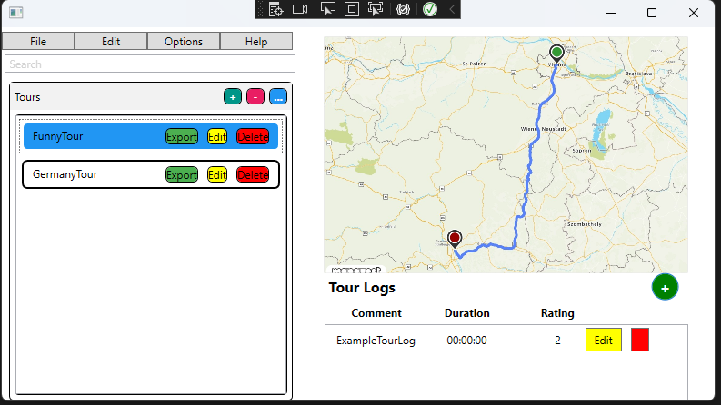
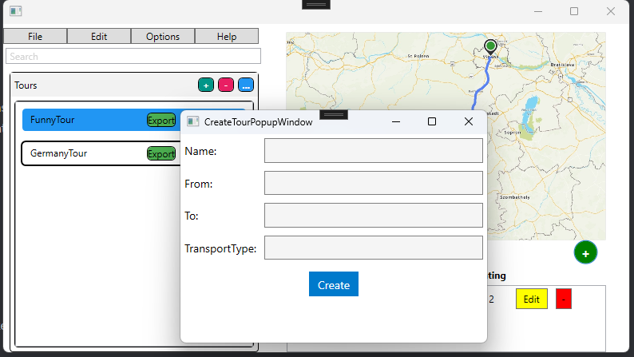
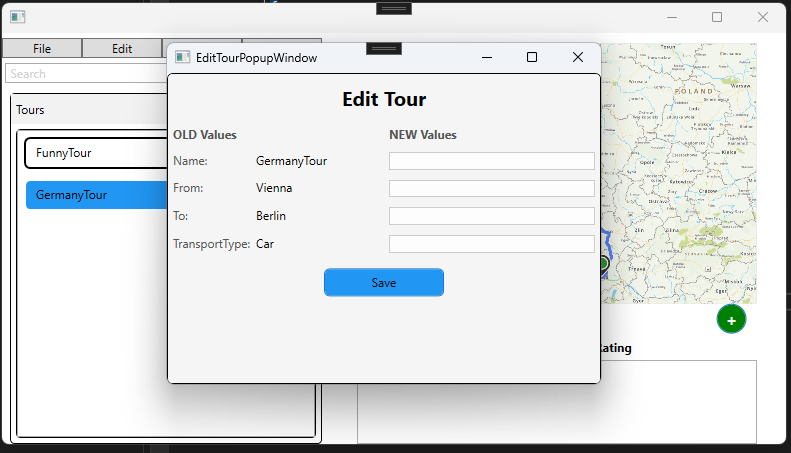
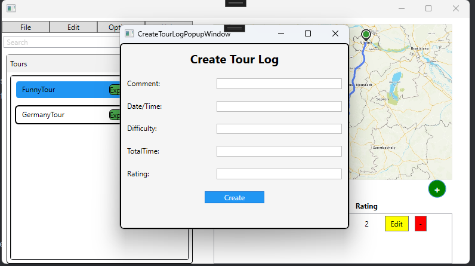
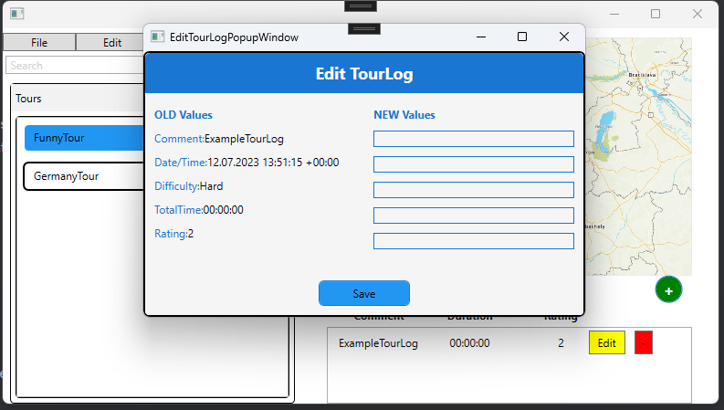
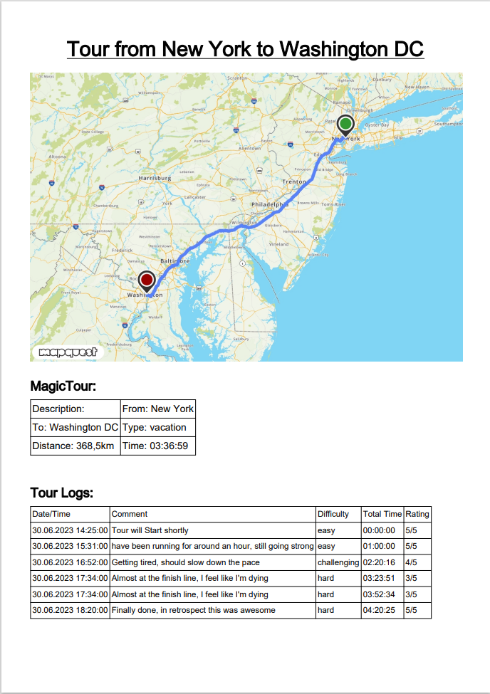
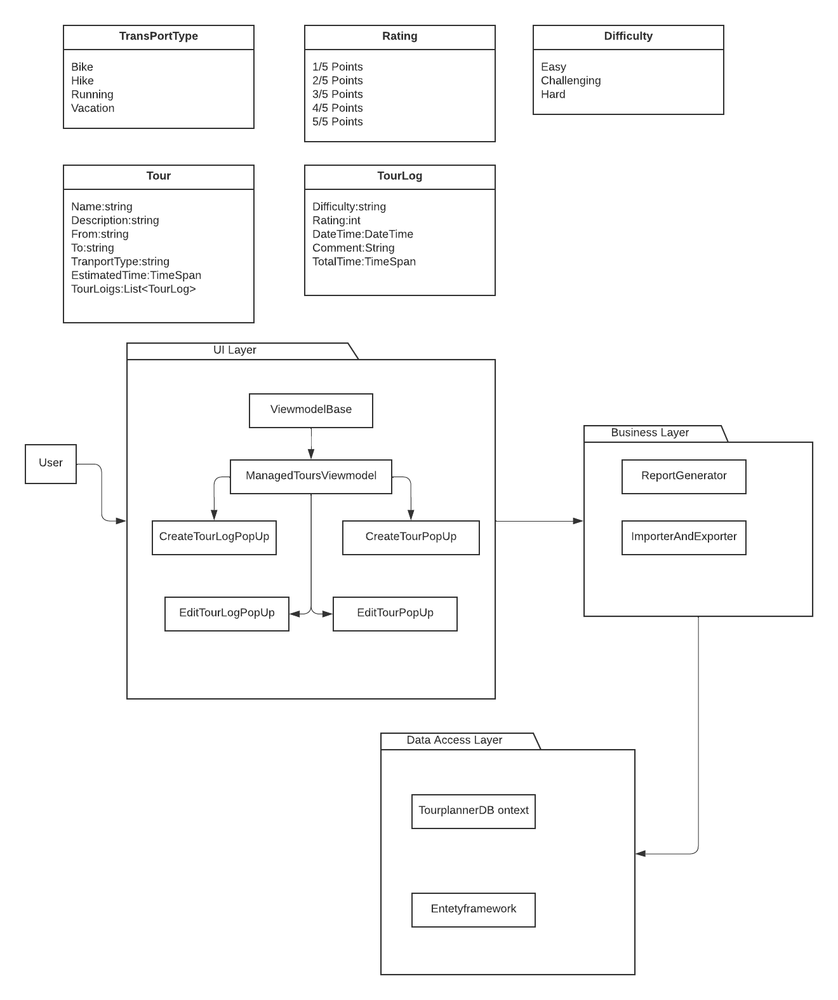
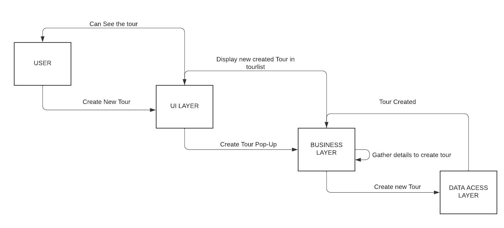

# Tour Planner

Tour Planner is a project developed by a team of two students [Erdem Sevilmis](https://github.com/Erdem-Sevilmis) and [Koale837](https://github.com/Koale8730). This project is a graphical-user-interface application based on WPF. The goal of this project is to allow users to create and manage tours (bike, hike, running, or vacation) in advance, as well as keep logs and statistical data of completed tours. 

## Goals
- Implement a graphical-user-interface based on WPF
- Apply the MVVM-pattern in C#
- Implement a layer-based architecture with a UI Layer, a business layer (BL), and a data access layer (DAL)
- Implement design-patterns in this project
- Define our own reusable UI-component
- Store the tour-data and tour-logs in a PostgreSQL database; images are stored externally on the filesystem
- Use of a logging framework like log4net
- Generating a report by using an appropriate library
- Writing our own unit-tests with JUnit
- Keeping our configuration (DB connection, base directory) in a separate config-file - not in the compiled source code
- Documenting our application architecture and structure as well as the development process and key decisions using UML and wireframes

## Features
- The user can create new tours (no user management, login, registration... everybody sees all tours)
- Every tour consists of name, tour description, from, to, transport type, tour distance, estimated time, route information (an image with the tour map)
  - The image, the distance, and the time should be retrieved by a REST request using the MapQuest Directions and Static Map APIs
- Tours are managed in a list, and can be created, modified, deleted (CRUD)
- For every tour, the user can create new tour logs of the accomplished tour statistics
  - Multiple tour logs are assigned to one tour
  - A tour-log consists of date/time, comment, difficulty, total time, and rating taken on the tour
- Tour logs are managed in a list, and can be created, modified, deleted (CRUD)
- Validated user-input
- Full-text search in tour- and tour-log data
- Automatically computed tour attributes
  - Popularity (derived from number of logs)
  - Child-friendliness (derived from recorded difficulty values, total times and distance)
  - Full-text search also considers the computed values
- Import and export of tour data (file format of your choice)
- The user can generate two types of reports
  - A tour-report which contains all information of a single tour and all its associated tour logs
  - A summarize-report for statistical analysis, which for each tour provides the average time, distance, and rating over all associated tour-logs

## Usage

To use this application, you will need to clone this repository and open it in your preferred IDE. After that, you will need to install the necessary dependencies and set up a PostgreSQL database to store tour data and logs. Once you have set up the environment, you can run the application and start creating tours and tour logs.

## Time Tracking
| Date       | Hours |
| ---------- | ----- |
| 02.05.2023 | 2h    |
| 04.05.2023 | 1h    |
| 10.05.2023 | 2h    |
| 11.05.2023 | 3h    |
| 17.05.2023 | 2h    |
| 18.06.2023 | 4h    |
| 18.06.2023 | 4h    |
| 21.06.2023 | 2h    |
| 22.06.2023 | 3h    |
| 22.06.2023 | 1h    |   
| 23.06.2023 | 3h    |
| 25.06.2023 | 2h    |
| 28.06.2023 | 3h    |
| 01.07.2023 | 3h    |
| 03.07.2023 | 2h    |
| 04.07.2023 | 4h    |
| 05.07.2023 | 3h    |
| 06.07.2023 | 2h    |
| 08.07.2023 | 4h    |
| 09.07.2023 | 3h    |
| 10.07.2023 | 2h    |

# Technical Steps and Decisions we made
Framework: WPF
Architecture: MVVM
Data Storage: Entityframwork
Design Patterns: Factory Pattern
UI Components: Subviews
Logging: Log4net
Unit Tests: Nunit
Report Generation: iText7
Features: Creating Tours, Creating Tourlogs, Edit Tours, Edit tourlogs, Import Tours, Export tours, generate PDF including all infos of the Tour.

Key decisions were made to ensure success in this project. The user interface was built using the WPF framework, taking advantage of its rich set of components and capabilities.

To improve maintainability, we separated our application into Model, View, and ViewModel components.

Entity Framework is a robust ORM framework that we chose for efficient data storage and management. By utilizing Entity Framework, we were able to interact with the underlying database seamlessly, perform CRUD operations, and manage tour-related data effectively.

The Factory Pattern was used to handle object creation. A consistent and reliable approach to the application can be provided by this design pattern.

To ensure comprehensive logging and monitoring, we integrated Log4net into the project. Log4net facilitated the capturing and tracking of valuable information, including debug messages, exceptions, and warnings. By leveraging Log4net, we could effectively troubleshoot issues, monitor the applications behavior, and ensure a smooth user experience.

NUnit was used as our unit testing framework to maintain code quality and verify the correctness of our implementation. With the help of NUnit, we were able to write and execute unit tests to make sure that the components we used met the desired specifications.

For generating comprehensive reports, we integrated iText7, a powerful PDF generation library. All the necessary information about the tours was included in the PDF documents. The tours essential information could be used to generate detailed reports.

## Application Features 

**UML Use Case Diagram:**

## UI Flow
This is the MainWindow which is used to navigate through the application.

This Pop-Up is shown when pressed on the + button to create a new Tour. All the necesary info must be provided.

The newly created Tour can be edited by pressing the yellow edit button next to the name of the tour.

This Pop-Up is shown when pressed on the + button, on the right bottom of the map, to create a new TourLog. All the necesary info must be provided.

The newly created TourLog can be edited by pressing the yellow edit button.

By pressing the green Export button next to the tour name. You will be provided with a PDF which includes all info about the tour.

## Application Architecture

**UML Class Diagram:**

**UML Sequence Diagram:**

## Unit Tests

**Why were these tests chosen?**  
The tests were selected based on their criticality to the project. It was crucial to thoroughly test these components as they play a vital role in ensuring the project's success. 

**Why is the tested code critical?**  
The tested code holds utmost importance as it serves as the foundation of the project. It plays a pivotal role in determining the functionality and overall success of the project.

## Credits

This project was developed by [Erdem Sevilmis](https://github.com/Erdem-Sevilmis) and [Koale837](https://github.com/Koale8730) as part of SS2023-SWEN2 at [FH Technikum Wien](https://www.technikum-wien.at/). Special thanks to [RaoulHolzer](https://github.com/RaoulHolzer) for the guidance and support throughout the project. 

## License

This project is licensed under the MIT License - see the [LICENSE](LICENSE) file for details.
